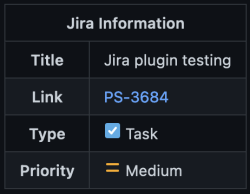

# Jira Fields as PR Labels

This action adds a few fields from Jira as a label on a pull request. It has the ability to sync all of the following fields:
- Issue type
- Priority
- Fix Versions
- Labels

Each PR label will have a specific prefix to clearly indicate what Jira field it represents.  
By default none of the fields are synced as labels, so you must specify at least one in order for this to have any effect.

This action will cause the job to fail if a Jira issue key is not found as part of the pull request or if the issue key does not exist in Jira. To prevent this from failing the workflow, you can use the [`continue-on-error`](https://docs.github.com/en/actions/using-workflows/workflow-syntax-for-github-actions#jobsjob_idstepscontinue-on-error) property offered by GitHub.
## Usage

Basic example
```yaml
name: My Pull Request Workflow

on:
  pull_request:
    types: [opened, edited, synchronize]

jobs:
  some_job_name:
    runs-on: ubuntu-latest
    steps:

      - uses: morficus/jira-fields-as-pr-labels@v1.0.0
        with:
          jira-base-url: ${{ vars.JIRA_BASE_URL }}
          jira-username: ${{ vars.JIRA_USERNAME }}
          github-token: ${{ secrets.GITHUB_TOKEN }}
          jira-api-token: ${{ secrets.JIRA_API_TOKEN }}
          sync-issue-type: true
```

By default, all no fields a synced, which means you must choose which fields to sync.
```yaml
name: My Pull Request Workflow

on:
  pull_request:
    types: [opened, edited, synchronize]

jobs:
  some_job_name:
    runs-on: ubuntu-latest
    steps:

      - uses: morficus/jira-fields-as-pr-labels@v1.0.0
        with:
          jira-base-url: ${{ vars.JIRA_BASE_URL }}
          jira-username: ${{ vars.JIRA_USERNAME }}
          github-token: ${{ secrets.GITHUB_TOKEN }}
          jira-api-token: ${{ secrets.JIRA_API_TOKEN }}
          sync-issue-type: true
          sync-issue-labels: true
```

If for some reason you do not want a fancy with basic ticket info to appear at the top of the PR description, you can turn that off

```yaml
name: My Pull Request Workflow

on:
  pull_request:
    types: [opened, edited, synchronize]

jobs:
  some_job_name:
    runs-on: ubuntu-latest
    steps:

      - uses: morficus/jira-fields-as-pr-labels@v1.0.0
        with:
          jira-base-url: ${{ vars.JIRA_BASE_URL }}
          jira-username: ${{ vars.JIRA_USERNAME }}
          github-token: ${{ secrets.GITHUB_TOKEN }}
          jira-api-token: ${{ secrets.JIRA_API_TOKEN }}
          inject-jira-info-table: false
          sync-issue-type: true
          sync-issue-labels: true
```

As a convenience, this action exposes a few properties on the Jira issue as outputs.  
For a full list of outputs, see the "Output Options" section.
```yaml
name: My Pull Request Workflow

on:
  pull_request:
    types: [opened, edited, synchronize]

jobs:
  some_job_name:
    runs-on: ubuntu-latest
    steps:

      - id: addLabel
        uses: morficus/jira-issue-type-label
        with:
          github-token: ${{ secrets.GITHUB_TOKEN }}
          jira-api-token: ${{ secrets.JIRA_API_TOKEN }}
          jira-username: ${{ vars.JIRA_USERNAME }}
          jira-base-url: ${{ vars.JIRA_BASE_URL }}
          sync-issue-type: true
          sync-issue-labels: true

      - name: Print the issue key
        run: echo "${{ steps.addLabel.outputs.issue-key }}"
```

## Input Options

| Key      | Description | Required | Default Value
| ----------- | ----------- | ----------- | ----------- |
| `github-token` | Token used to add labels to the PR. Can be passed in using `${{ secrets.GITHUB_TOKEN }}`       | true | undefined
| `jira-api-token` | API Token used to access the Jira REST API. Must have read access to your Jira projects & issues. For details, see Atlassian's official documentation: https://support.atlassian.com/atlassian-account/docs/manage-api-tokens-for-your-atlassian-account/       | true | undefined
| `jira-username` | Username that can use the Jira API token. Must have read access to your Jira projects & issues. For details, see Atlassian's official documentation: https://support.atlassian.com/atlassian-account/docs/manage-api-tokens-for-your-atlassian-account/       | true | undefined
| `jira-base-url` | Your Jira subdomain. i.e.: https://your-domain.atlassian.net       | true | undefined
| `issue-key-location` | Where in the PR to look for issue key. Values can be: `branch`, `title` or `both`       | false | `title`
| `inject-jira-info-table` | Flag indicating if the table with the basic ticket information should be added to the top of the PR description       | false | `true`
| `sync-issue-type` | Flag indicating if the "issue type" from Jira should be added as a PR label | false | `false`
| `sync-issue-priority` | Flag indicating if the "priority" value from Jira should be added as a PR label | false | `false`
| `sync-issue-labels` | Flag indicating if the "labels" from Jira should be added as a PR label | false | `false`
| `sync-issue-fix-versions` | Flag indicating if the "fix versions" from Jira should be added as a PR label | false | `false`

## Output Options

| Key   | Description   
| ----------- | ----------- |
| `issue-key` | The Jira issue key that was found
| `issue-type` | The Jira issue type for the corresponding Jira issue 
| `issue-priority` | The priority set in Jira for the corresponding Jira issue
| `issue-labels` | The labels set in Jira for the corresponding Jira issue
| `issue-fix-versions` | The fix versions on the corresponding Jira issue


## Frequently Asked Questions

<details>
  <summary>How do I create a Jira API token?</summary>
  See Atlassian's official documentation: https://support.atlassian.com/atlassian-account/docs/manage-api-tokens-for-your-atlassian-account/
</details>

<details>
  <summary>How do I create a GitHub API token?</summary>
  There is no need to do this manually. GitHub automatically provides/injects a token in every job that can be used for GitHub Actions. The default environment variable name is `secrets.GITHUB_TOKEN`.  
You can check out the official GitHub documentation for more information about it: https://docs.github.com/en/actions/security-guides/automatic-token-authentication
</details>

<details>
  <summary>Can I change the label colors?</summary>
  Sure you can! Once this action adds the label to the PR, you can change its color (or add a description) like you would any other label. You can check out the official GitHub documentation on how to do that: https://docs.github.com/en/issues/using-labels-and-milestones-to-track-work/managing-labels#editing-a-label
</details>

<details>
  <summary>Does this work with Jira Server (aka: on-prem)?</summary>
  Honestly, no clue. I don't have access to a Jira Server instance so I'm not able to test it.  
But seeing how Atlassian is [ending support for it](https://www.atlassian.com/migration/assess/journey-to-cloud), there are no plans to support it.
</details>

<details>
  <summary>Does this work with Jira Data Center edition?</summary>
  Honestly, no clue. I don't have access to a Jira Data Center instance so I'm not able to test it.  
But if you do have access to one, I would not mind working together to get things working
</details>

## Future Functionality / Road Map
Here are a few things I want to add to this project over time

- [x] Option to sync labels from Jira to PR labels
- [x] Option to sync the issue priority from Jira to PR labels
- [x] Option to sync "fix versions" from Jira to PR labels
- [ ] Option to sync "sprint" from Jira to PR a label
- [ ] Option to add the Jira "fix version" as a "[Milestone](https://docs.github.com/en/issues/using-labels-and-milestones-to-track-work/about-milestones)" on the PR
- [ ] Option to add the Jira "sprint" as a "[Milestone](https://docs.github.com/en/issues/using-labels-and-milestones-to-track-work/about-milestones)" on the PR
- [ ] Ability to manage labels via a configuration file (this might end up being a different action)

## Inspiration
Inspiration for this action came from the following existing projects:
- [jira-description](https://github.com/marketplace/actions/jira-description)
- [jira-lint](https://github.com/marketplace/actions/jira-lint)